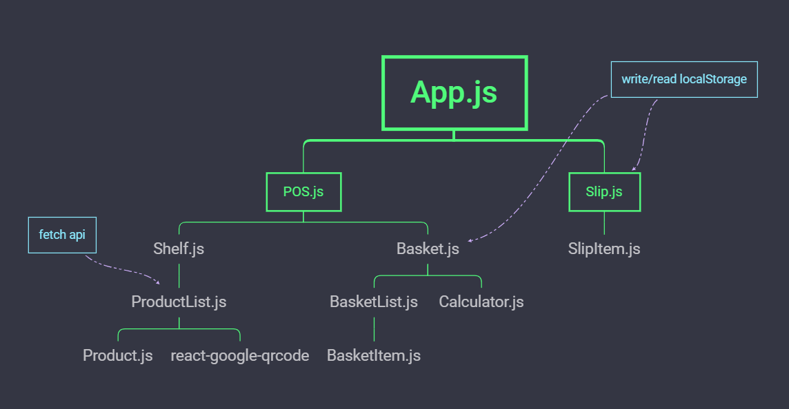

## Description

This Simple POS by [Create React App](https://github.com/facebook/create-react-app)
- fetch APIs and can filter by product type.
- click display full description for each product.
- use [react-google-qrcode](https://github.com/iamgutz/react-google-qrcode) generate qr of link of product.
- calculate total product in basket and calculate change amount.
- display simple slip when submit order.

## This demo

click this 👉 [nott-react-pos.herokuapp.com](https:/nott-react-pos.herokuapp.com)

## API 
detail on this 👍 [https://makeup-api.herokuapp.com/](https://makeup-api.herokuapp.com/)

### Structure

## Available Scripts

In the project directory, you can run:

### `npm start`

Runs the app in the development mode. 
Open [http://localhost:3000](http://localhost:3000) to view it in the browser.

The page will reload if you make edits. 
You will also see any lint errors in the console.

### `npm run build`

Builds the app for production to the `build` folder. 
It correctly bundles React in production mode and optimizes the build for the best performance.

The build is minified and the filenames include the hashes. 
Your app is ready to be deployed!

See the section about [deployment](https://facebook.github.io/create-react-app/docs/deployment) for more information.

